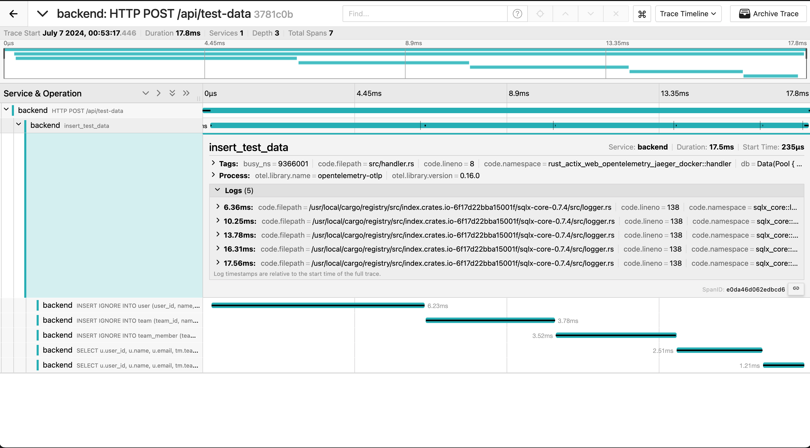

# rust-actix-web-opentelemetry-jaeger-docker
## All you have to do is...
### Step 1. Prepare API
```shell
docker-compose up --build -d
```

* wait for cargo build/run completed

### Step 2. Insert some test data
```shell
curl -X POST http://localhost:8000/api/test-data
```

### Step 3. Check out Jaeger page
* Go to http://localhost:16686
* "Find Traces"
* You can check the logs for #[tracing::instrument] as well as manually added spans

